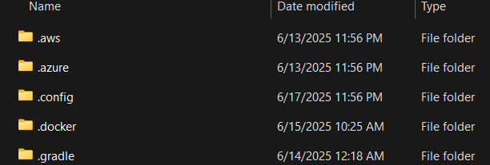

# Neovim Configurations

## Plugins
- LSP management: "neovim/nvim-lspconfig", "mason-org/mason-lspconfig.nvim", "mason-org/mason.nvim", "WhoIsSethDaniel/mason-tool-installer.nvim",
- Code & Motions: "nvim-treesitter/nvim-treesitter", "aaronik/treewalker.nvim", "folke/flash.nvim",
- Completions: "L3MON4D3/LuaSnip", "saadparwaiz1/cmp_luasnip", "rafamadriz/friendly-snippets", "hrsh7th/nvim-cmp", "hrsh7th/cmp-nvim-lsp", "hrsh7th/cmp-buffer", "hrsh7th/cmp-path", "onsails/lspkind.nvim"
- "folke/snacks.nvim": LSP functions, File Explorer, Picker, Lazygit, etc.
- "echasnovski/mini.nvim": mini.pairs, mini.ai, mini.icons
- Git: "NeogitOrg/neogit",
- Lua: "folke/lazydev.nvim",
- Python: "benlubas/molten-nvim", "3rd/image.nvim",
- Markdown: "MeanderingProgrammer/render-markdown.nvim",

## Build

### Ubuntu
- Install neovim dependencies (Drop any unneeded):
```
sudo apt install gcc npm python3 python3-pip python3-venv luarocks unzip build-essential fd-find ripgrep
```
- Install plugin dependencies from npm:
```
sudo npm install -g neovim tree-sitter-cli
```
- Download latest version of Neovim (not available on Ubuntu apt):
```
curl -LO https://github.com/neovim/neovim/releases/latest/download/nvim-linux-x86_64.tar.gz
```
- Extract neovim and place it into desired location:
```
tar -xvzf nvim-linux-x86_64
mv nvim-linux-x86_64 ~/.local/
rm nvim-linux-x86_64.tar.gz
```
- In .bashrc, add the PATH to neovim:
```
export PATH="$HOME/.local/nvim-linux-x86_64/bin:$PATH"
source ~/.bashrc
```
- Verify installation:
```
nvim --version
```

#### LaTeX support
- Install LaTex dependencies:
```
sudo apt install texlive-latex-extra biber latexmk texlive-bibtex-extra
```

#### Jupyter Notebook support using molten.nvim
- Install terminal supporting Kitty Graphics Protocol (Kitty, Ghostty) and make it available in PATH:
```
curl -L https://sw.kovidgoyal.net/kitty/installer.sh | sh
ln -s ~/.local/kitty.app/bin/kitty ~/.local/bin/kitty
```
- Install image.nvim dependencies for rendering images in the terminal:
```
sudo apt install imagemagick
```
- Create virtual environment to host Neovim/Molten.nvim Python dependencies (using benlubas/venv_wrapper).
```
mkvenv neovim
venv neovim
```
- Install Remote Plugin APIs (Python client and Jupyter client):
```
pip install pynvim jupyter_client plotly kaleifo pnglatex pyperclip cairosvg
```
> Additional dependencies can include: `pnglatex` (for rendering TeX equations), `pyperclip` (To use molten_copy_output).
>Alternatively, if using Conda:
```
conda install -c conda-forge jupyter_client
```
- Point Neovim to the venv:
```
vim.g.python3_host_prog=vim.fn.expand("~/.virtualenvs/neovim/bin/python3")
```
- Install the kernel in a project virtual environment:
```
venv project_name
pip install ipykernel
python -m ipykernel install --user --name project name
```
- Launch Neovim with project venv active, and should be able to run `:MoltenInit {project_name}` to start kernel for project venv.

### Windows (or WSL)
#### Jupyter Notebook support
Images.nvim relies on Kitty Graphics Protocol for rendering images in the terminal.
Neither Kitty nor Ghostty are supported on Windows OS, however, with WSL2 (and WSLg) it is possible to launch Kitty terminal from inside WSL.

## Issues
- nvim-java not compatible with Mason v2.0 (https://github.com/nvim-java/nvim-java/issues/384)

## Potential Plugins
- "zeioth/compiler.nvim"
- harpoon (but first might be worth exploring built-in Marks)
- `yetone/avante.nvim`: AI support similar to Cursor IDE.
- `shortcuts/no-neck-pain.nvim`: Center focues buffer.

## References
- Potential contribution to implement support for snacks.image in molten-nvim (https://github.com/benlubas/molten-nvim/discussions/285).


